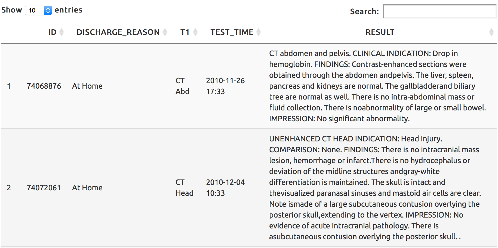
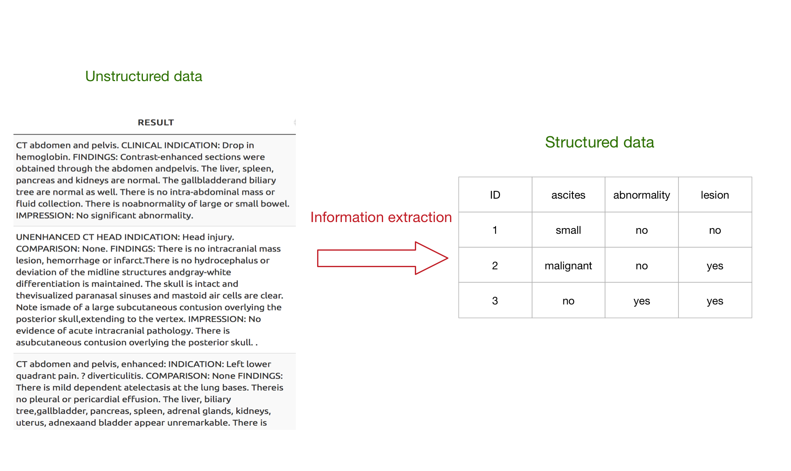
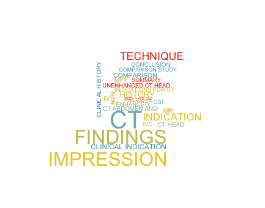

Text Data Presentation
========================================================
width: 1000
height: 800
author: Lisa Ling
date: December 06 2015
transition: rotate


<small> 
Department of Statistics   
Dalhousie University   
</small>


Outline
========================================================


- What text data looks like
- Goal--Structured data
- Questions--Information Extraction


What text data looks like
========================================================
The radiology data will contribute to improving accuracy of our hierarchical tree structure model. However, this is an unstructured text data.




Goal--What we are interested in
========================================================

We're only interested in specific kinds of information in text, the relation between radiology test findings and their status, i.e. **“which finding in which status”**.

 Finding   | status  
 ----------|--------------------
 mass      | no/yes         
 ascites   | small/malignent/no         
 collection| no/yes        


Goal--Structured Data
========================================================




Goal
========================================================

1. Build a system that extracts structured data from unstructured text
2. Robust methods for identifying the entities and relationships described
in a text. Reduce error and misunderstand.
3. Model evaluation


Question--Information Extraction
========================================================
type: section

- Fetch the key words (abnormal, metastatic, collection, mass etc.) 
- Spelling Correction


Question--Information Extraction
========================================================
transition: none
incremental: true

### Fetch the key words 


- Consider synonyms for key words
    - metastatic, metastases, metastasis
- Consider various expressions. 
    - No significant abnormality
    - No acute intracranial abnormality
    - No due to cervicalspine abnormality
    - is uncertain whether this is a true lesion
 


Question--Information Extraction 
========================================================
transition: none
incremental: true

- Consider various expressions. 
    - No significant abnormality
    - No acute intracranial abnormality
    - No due to cervicalspine abnormality
    - is uncertain whether this is a true lesion
- Consider positive/negtive
    - No acute intracranial abnormality/ No abnormality
    - abnormality
- Consider categorical levels
    - no signs of ascites
    - very small amount of ascites
    - malignant ascites   
    
    

Question--Information Extraction 
========================================================
transition: none
incremental: true

### Spelling Correction


- **Spelling mistake**: abnormaliti
- **No space**: noevidence, nohemorrhage, noabnormality, theright, nodefinite, metastaticdisease
- **dash sign**: intra abdominal, intra-abdominal
  


Example 1
========================================================
CT abdomen and pelvis. CLINICAL INDICATION: Drop in hemoglobin. FINDINGS: Contrast-enhanced sections were obtained through the abdomen andpelvis. The liver, spleen, pancreas and kidneys are normal. The gallbladderand biliary tree are **normal** as well. There is **no** intra-abdominal **mass** or fluid **collection**. There is <span style="color:red">noabnormality</span> of large or small bowel. IMPRESSION: No significant **abnormality**.


Example 2 
========================================================


CT abdomen and pelvis, enhanced: INDICATION: Left lower quadrant pain. <span style="color:red">? diverticulitis</span>. COMPARISON: None  FINDINGS: There is mild dependent **atelectasis** at the lung bases. Thereis **no** **pleural** or **pericardial effusion**. The liver, biliary tree,gallbladder, pancreas, spleen, adrenal glands, kidneys, uterus, adnexaand bladder appear unremarkable. There is diffuse <span style="color:red">colonicdiverticulosis</span> and note is made of a normal appearing appendix. Thereis mucosal thickening in the distal sigmoid colon with marked adjacentinflammatory change, consistent with acute **diverticulitis**. There is <span style="color:red">noevidence</span> of **perforation** or focal **abscess** formation. There is <span style="color:red">noascites</span> or enlarged mesenteric, retroperitoneal or inguinal lymphnodes. There is degenerative disc disease and facet OA at L5/S1. Thereare **no** aggressive appearing osseous **lesions**. IMPRESSION: There is acute sigmoid **diverticulitis without associatedabscess** or **perforation**. Additional uncomplicated **diverticula** are notedthroughout the remainder of the colon.


Example 2--What we did  
========================================================


```
[[1]]
 [1] " is mild dependent atelectasis"                
 [2] " no pleural or pericardial effusion"           
 [3] " is diffuse colonicdiverticulosis"             
 [4] "normal"                                        
 [5] " consistent with acute diverticulitis"         
 [6] " is noevidence of perforation or focal abscess"
 [7] " is noascites"                                 
 [8] " no aggressive appearing osseous lesion"       
 [9] " is acute sigmoid diverticulitis"              
[10] " without associatedabscess or perforation"     
[11] " uncomplicated diverticula"                    
```


We'd love to listen to your suggestion! Thank you!
========================================================


</img>


